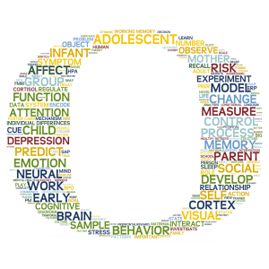

```{r setup, include=FALSE}
options(htmltools.dir.version = FALSE)
library(countdown)
library(tidyverse)

xaringanExtra::use_xaringan_extra(include = c("panelset", "tile_view", "share_again"))
xaringanExtra::style_share_again(share_buttons = c("twitter", "linkedin", "pocket"))

# your turn counter
yt_counter <- 0
```

```{r xaringan-themer, include=FALSE, warning=FALSE}
library(xaringanthemer)
style_mono_accent(base_color = "#15758c",
                text_font_google = google_font("Montserrat", "300", "300i"),
                code_font_google = google_font("Source Code Pro"),
                link_color = "#15758c",
                code_inline_color = "#fc653a")
```

class: title-slide, center, middle

# Welcome

## Introduction and Orientation

---
class: split-four

# Hello `r emo::ji("wave")`

###  Welcome to the 5th annual UO R Bootcamp!

--

## <center>The Team</center>

.column[.content[.center[
<br><br><br><br><br><br><br><br><br><br><br><br><br>
```{r echo = FALSE, out.width="75%"}

```

### Cameron
]]]

.column[.content[.center[
<br><br><br><br><br><br><br><br><br><br><br><br><br>
```{r echo = FALSE, out.width="75%"}

```

### Sarah D.
]]]

.column[.content[.center[
<br><br><br><br><br><br><br><br><br><br><br><br><br>
```{r echo = FALSE, out.width="75%"}
knitr::include_graphics("images/dominik.png")
```

### Dominik
]]]

.column[.content[.center[
<br><br><br><br><br><br><br><br><br><br><br><br><br>
```{r echo = FALSE, out.width="75%"}

```

### Sarah M.
]]]

---
# Schedule `r emo::ji("calendar")`

#### **Day 1: Tuesday, 9/20, 9 AM - 11 AM PDT**
+ Basics of R, RStudio, & R Markdown
+ Data Types & Structures

--

#### **Day 2: Thursday, 9/22, 9 AM - 2 PM PDT**
+ Functions, Packages, & Debugging
+ Piping
+ Introduction to the Tidyverse
+ Importing Data & Project-Oriented Workflows
+ Data Wrangling with {dplyr}

--

#### **Day 3: Friday, 9/23, 9 AM - 1 PM PDT**
+ Data Tidying with {tidyr}
+ Data Visualization with {ggplot2}
+ R Tips & Tricks

---
class: split-two
# Logistics

.column[.content[.center[
<br><br><br><br><br>
# [`r fontawesome::fa("slack", height = "120px")`](https://uodatascience.slack.com/)

### Slack <br> (#bootcamp2022)
]]]

.column[.content[.center[
<br><br><br><br><br>
# [`r fontawesome::fa("github", height = "120px")`](https://github.com/uopsych/summeR-bootcamp-2022)

### GitHub
]]]

---
# A word of encouragement

+ R has a substantial learning curve, but...

--

  + 1) It's absolutely worth it! (I promise)
  
--

  + 2) *Everyone* goes through this
  
--

> “There is no way of going from knowing nothing about a subject to knowing something about a subject without going through a period of great frustration and much suckiness.”

--

.right[-Hadley Wickham, <br>Chief Scientist at RStudio]

.right[
```{r echo=FALSE, out.width="25%"}
knitr::include_graphics("images/hadley.jpg")
```
]

---
# A word of encouragement

+ R has a substantial learning curve, but...

  + 1) It's absolutely worth it! (I promise)

  + 2) *Everyone* goes through this

```{r, echo = FALSE, messages=FALSE, warning=FALSE, error=FALSE, fig.height=4, fig.width=10, fig.align='center', fig.retina=2} 
experience <- data.frame(experience = c(3, 5, 5, 5, 5, 5, 5, 2, 2, 5, 4, 
                                        4, 5, 5, 6, 2, 5, 1, 3, 5, 3))

experience %>%
  ggplot(aes(x = experience)) +
    geom_bar(fill = "#15758c") +
    scale_x_continuous(limits = c(.5, 8.5), 
                       breaks = seq(1, 8, 1), 
                       labels = c("1\nThe letter?",
                                  "2\nI think I've\nheard of it.",
                                  "3\nI've definitely\nheard of it.",
                                  "4\nI've opened it\nbefore.",
                                  "5\nI've used it to\nanalyze data.",
                                  "6\nI often use it to\nanalyze data.",
                                  "7\nI am an expert\nR user.",
                                  "8\nI am Hadley\nWickham.")) +
    scale_y_continuous(limits = c(0, 11),
                       breaks = seq(0, 11, 1)) +
    theme_bw() +
    labs(title = "Which of the following best describes your prior experience with R?",
         x     = "Experience", 
         y     = "Count") +
    theme(axis.title.x = element_blank(),
          axis.text = element_text(color = "black", size = 10))

```


---

.footnote[Artwork by [@allison_horst](https://twitter.com/allison_horst)]

.pull-left[.center[
```{r echo=FALSE, out.width="60%"}
knitr::include_graphics("images/breakr.gif")
```
]]

.pull-right[.center[
```{r echo=FALSE, out.width="60%"}
knitr::include_graphics("images/stormyr.gif")
```
]]

--

.center[
# `r emo::ji("clock3")` + `r emo::ji("flex")` ...
]

--

.pull-left[.center[
```{r echo=FALSE, out.width="60%"}
knitr::include_graphics("images/heartyr.gif")
```
]]


.pull-right[.center[
```{r echo=FALSE, out.width="60%"}
knitr::include_graphics("images/rainbowr.gif")
```
]]


---
# What are R & RStudio?

--

.pull-left[
<br>
.center[
```{r echo=FALSE, out.width="40%"}
knitr::include_graphics("images/r_logo.png")
```
]
<br><br>
**R** is a programming language designed for statistics and data science
]


--

.pull-right[
.center[
```{r echo=FALSE}
knitr::include_graphics("images/rstudio_logo.png")
```
]

**RStudio** is an integrated development environment (IDE) that provides an interface to R.

RStudio also *currently* refers to the [company](https://rstudio.com/about/) that develops RStudio.
]
---
# What are R & RStudio?

```{r echo=FALSE}
knitr::include_graphics("images/engine_dashboard.png")
```

.footnote[Image from [*Modern Dive*](https://moderndive.netlify.app/1-1-r-rstudio.html)]
---

# Why use R?

## It's open source

--

+ It's free!

--

+ It's easier to share your data & code

--

+ Innovations spread quickly

--

+ *You* can contribute!

---

# Why use R?

## It's powerful & flexible

--

+ You can use R for more than data analysis, including:

  + creating websites (including this one!)
  
  + slideshows (including this one!)
  
  + creating reproducible documents (including documents you will create in this bootcamp!)
  
  + books (e.g., [Hands-On Machine Learning with R](https://bradleyboehmke.github.io/HOML/))
  
  + web applications (e.g., [Monte Carlo Power Analysis for Indirect Effects](https://schoemanna.shinyapps.io/mc_power_med/))
  
  + entire APA-formatted manuscripts (e.g., [papaja](https://github.com/crsh/papaja))
--

+ In R, it is never *if* but *how*...

---
# Why use R?

## It's a useful, transferable skill

--

+ R is used across many industries, especially in UX & data science

+ It is easier to learn a new programming language when you already know one

---
# Why use R?

## Reduce errors, enhance reproducibility & transparency

--

+ Generate publication-quality figures & tables within R, reducing copy-and-paste errors

--

+ Create detailed and fully-documented scripts showing every step between raw data & stats

--

+ You can use R to automate reporting of your analyses (for HW or publication), reducing all too common errors in reported statistics (see [Nuijten et al.](https://link.springer.com/article/10.3758/s13428-015-0664-2))

---
# Why use R?

## It's efficient

--

+ It saves you time in the long run

--

+ Scripts make re-using past work or using others' work as a starting point much easier

--

+ Typing scripts is much faster than clicking through menus, *especially* after you get the hang of keyboard shortcuts

--

+ It runs faster and is less bloated than GUI-based statistical software (e.g., SPSS)

---
# Why use R?

## It's fun `r emo::ji("partying_face")`

---
class: inverse, center, middle
# Q & A

```{r echo=FALSE}
countdown(minutes = 3)
```

---

class: inverse, center, middle

# Let's get started!

