```{r setup, include=FALSE}
options(htmltools.dir.version = FALSE)
library(countdown)
library(tidyverse)
library(tictoc)
library(microbenchmark)
library(beepr)
library(plotly)
library(gganimate)

xaringanExtra::use_xaringan_extra(include = c("panelset", "tile_view", "share_again"))
xaringanExtra::style_share_again(share_buttons = c("twitter", "linkedin", "pocket"))

# your turn counter
yt_counter <- 0
```

```{r xaringan-themer, include=FALSE, warning=FALSE}
library(xaringanthemer)
style_mono_accent(base_color = "#15758c",
                text_font_google = google_font("Montserrat", "300", "300i"),
                code_font_google = google_font("Source Code Pro"),
                link_color = "#15758c",
                code_inline_color = "#fc653a")
```

class: title-slide, center, middle

# R Tips & Tricks

---

# Use a Ligature Font

--

One (superficial) way to improve your code is to use a **ligature font**.

Ligatures are special characters composed of two (or more) characters.

--

.pull-left[
**Without Ligatures**
```{r echo=FALSE, out.width="80%", fig.align='left'}
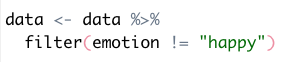
```
]

.pull-right[
**With Ligatures**
```{r echo=FALSE, out.width="80%", fig.align='left'}
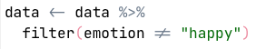
```
]

--

My ligature font of choice is [JetBrains Mono](https://www.jetbrains.com/lp/mono/), but there are [many](https://betterwebtype.com/articles/2020/02/13/5-monospaced-fonts-with-cool-coding-ligatures/) to choose from.

---

# Use a Ligature Font

To start using a ligature font, all you need to do is install the font on your [Mac](https://support.apple.com/en-us/HT201749) or [PC](https://support.microsoft.com/en-us/office/add-a-font-b7c5f17c-4426-4b53-967f-455339c564c1) and then choose the font in RStudio's preferences pane:

```{r echo=FALSE, out.width="40%", fig.align='center'}
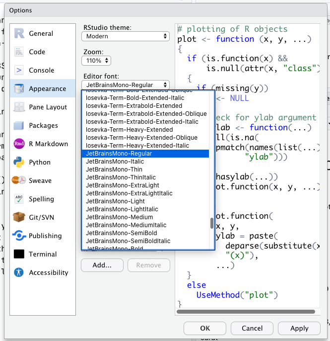
```

---

# Use a Different Theme

--

Another superficial way to improve your code is to change RStudio's default theme. 

--

As with fonts, you can change the theme in RStudio's preferences pane.

```{r echo=FALSE, out.width="40%", fig.align='center'}
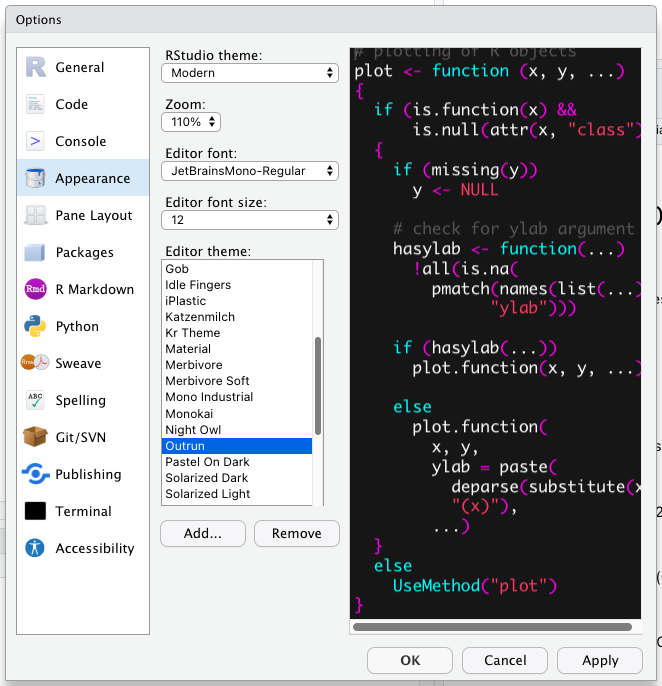
```

---

# Use a Different Theme

You can also [download](https://www.rstudio.com/blog/rstudio-ide-custom-theme-support/) and [create](https://tmtheme-editor.herokuapp.com/#!/editor/theme/Monokai) custom themes. 

--

I created (and use) the [outRun](https://github.com/camkay/outRun) theme, but I encourage you to find a theme that suits your personal style. 

---

# Enable Rainbow Parentheses 

--

**Rainbow Parentheses** colour matches opening parentheses with closing parentheses.

--

.pull-left[
**Without Rainbow Parentheses**
```{r echo=FALSE, out.width="80%", fig.align='left'}
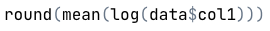
```
]

.pull-right[
**With Rainbow Parentheses**
```{r echo=FALSE, out.width="80%", fig.align='left'}
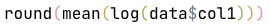
```
]

---

# Enable Rainbow Parentheses 

You can enable Rainbow Parentheses by clicking the checkbox beside Rainbow Parentheses in RStudio's preferences pane. 

```{r echo=FALSE, out.width="40%", fig.align='center'}
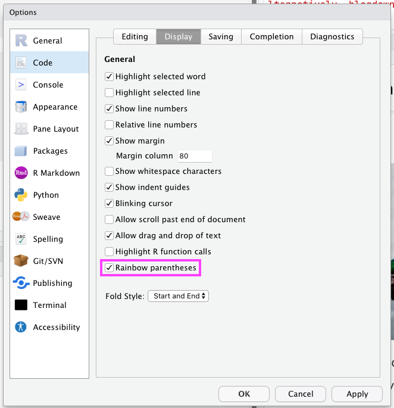
```

---

# Enable Spell-Checking

--

**Real-time spell-checking** will check your spelling in... well... real time. 

--

.pull-left[
**Without Real-Time Spell-Checking**
```{r echo=FALSE, out.width="100%", fig.align='left'}
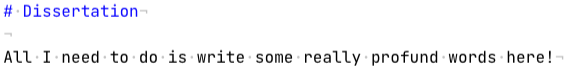
```
]

.pull-right[
**With Real-Time Spell-Checking**
```{r echo=FALSE, out.width="100%", fig.align='left'}
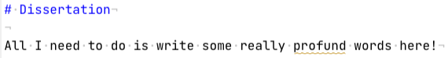
```
]

---

# Enable Spell-Checking

You can enable real-time spell-checking by clicking the checkbox beside real-time spell-checking in RStudio's preferences pane. 

```{r echo=FALSE, out.width="40%", fig.align='center'}
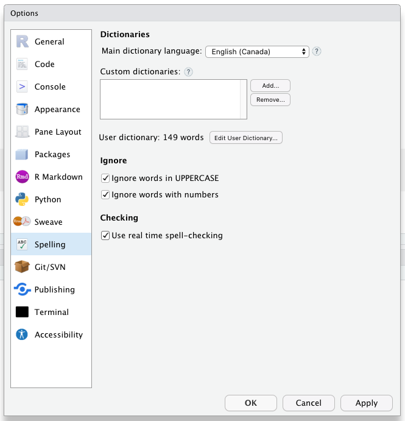
```

---

# Start-Up Messages

--

You can set R to provide a custom start-up message every time you start or restart R. 

--

For example, I use my package [{merlinmann}](https://github.com/camkay/merlinmann) to deliver me a random piece of wisdom from Merlin Mann every time I start or restart R:

```{r echo=FALSE, out.width="50%", fig.align='center'}
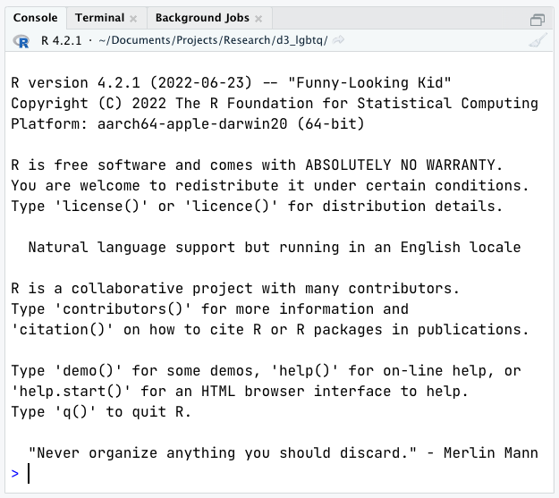
```

---

# Start-Up Messages

Other custom start-up message options include:

- Mitch Hedberg jokes from the [{mitchhedberg}](https://github.com/mkearney/mitchhedberg) package.
- Chuck Norris jokes from the [{norris}](https://github.com/chriscardillo/norris) package.
- Dad jokes from the [{dadjokeapi}](https://github.com/jhollist/dadjokeapi) package.
- The Office quotes from the [{dundermifflin}](https://cran.r-project.org/web/packages/dundermifflin/dundermifflin.pdf) package.
- The Good Place quotes from the [{goodshirt}](https://github.com/adam-gruer/goodshirt) package.
- General statistics, data visualization, and science quotes from the [{statquotes}](https://cran.r-project.org/web/packages/statquotes/statquotes.pdf) package.
- Random facts about Carl Friedrich Gauss from the [{gaussfacts}](https://cran.r-project.org/web/packages/gaussfacts/) package.
- Praise from the [{praise}](https://cran.r-project.org/web/packages/praise/praise.pdf) package.
- Fortunes from the [{fortunes}](https://cran.r-project.org/web/packages/fortunes/fortunes.pdf) package.

--

For more information on using these packages, I would recommend reading [the Customise your RStudio Startup Message tutorial](https://damien-datasci-blog.netlify.app/post/2020-12-31-pimp-your-r-startup-message/) from Damien Dupré.

---

# Multicursor Selection

--

Holding down Option (<key>⌥</key>) on Mac or Alt (<key>Alt</Key>) on PC while clicking and dragging the cursor allows you to create a cursor across multiple lines:

```{r echo=FALSE, out.width="50%", fig.align='center'}
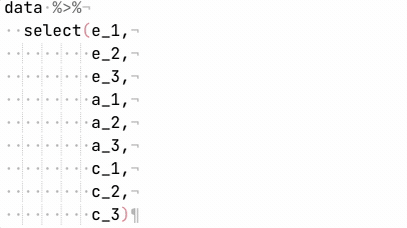
```

---

# Multicursor Selection

Holding down Option and Command (<key>⌥</key> + <key>⌘</key>) on Mac or Alt and Control (<key>Alt</Key> + <key>Ctrl</key>) on PC while clicking at different locations in your script allows you to create multiple cursors with different horizontal locations.

```{r echo=FALSE, out.width="60%", fig.align='center'}
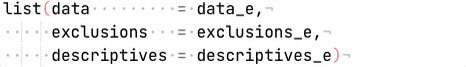
```

---

# Comment Chunks of Code

--

You can comment out multiple lines of code by highlighting them and then clicking Shift, Command, and C (<key>⇧</key> + <key>⌘</key> + <key>C</key>) on Mac or Control, Shift, and C (<key>⇧</key> + <key>Ctrl</key> + <key>C</key>) on PC.

```{r echo=FALSE, out.width="40%", fig.align='center'}
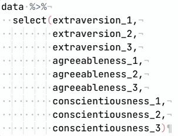
```

---

# Search Through Code History

--

You can search for previously evaluated lines of code by pressing the up arrow (<key>↑</key>) on your keyboard. 

```{r echo=FALSE, out.width="60%", fig.align='center'}
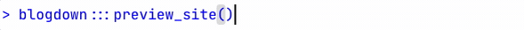
```

---

# Search the Help System

--

The question mark (`?`) is very useful for looking up the help documentation for a given function (e.g., `?mean`) but, sometimes, the function you are looking for is in a package that is not loaded.

In those cases, you can use two question marks (`??`) to search all of the help documentation.

For example, typing`??if_else` in the console returns:

```{r echo=FALSE, out.width="40%", fig.align='center'}
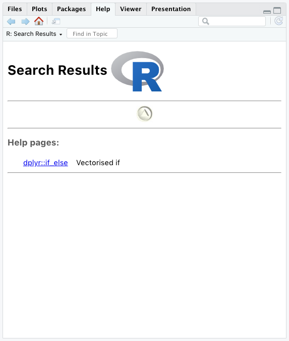
```

---

# Assignment Pipe

--

We've talked about regular pipes (`%>%`), but the `{magrittr}` package also has a number of alternative pipes available.footnote[*Note.* These are not loaded as part of the `{tidyverse}` package; you will need to load the `{magrittr}` package separately to use them.].

--

One useful alternative pipe is the **asignment pipe** (`%<>%`). The assignment pipe pipes an object forward---as a normal pipe does---but it assigns the result of the pipe to the original object.

---

# Assignment Pipe

We've talked about regular pipes (`%>%`), but the `{magrittr}` package also has a number of alternative pipes available.

One useful alternative pipe is the **asignment pipe** (`%<>%`). The assignment pipe pipes an object forward---as a normal pipe does---but it assigns the result of the pipe to the original object.

For example:

.pull-left[
```{r}
x <- c(1, 2, 3, 4)

x <- x %>%
  mean() %>%
  round()

x
```
]

.pull-right[
```{r}
x <- c(1, 2, 3, 4)

x %<>%
  mean() %>%
  round()

x
```
]

---

# Pipes Redux

--

Thus far, we've used pipes only in cases where we want to pass an object to the first argument in subsequent functions. However, sometimes, we will want to pass an object to the second, third, or fourth (etc.) argument.

--

Take, for example, the `gsub()` function in Base R. `gsub()` replaces some set of characters in a string with another set of characters:

```{r}
the_best_star_trek <- "Star Trek: The Next Generation"

the_best_star_trek <- gsub(pattern     = "The Next Generation", 
                           replacement = "Voyager", 
                           x           = the_best_star_trek)

the_best_star_trek
```

--

What if we wanted to pipe `the_best_star_trek` to the `gsub()` function?

---

# Pipes Redux

We can use the dot placeholder (`.`). Essentially, the dot placeholder tells `{magrittr}` where to pipe the information. 

For example:

```{r}
the_best_star_trek <- "Star Trek: The Next Generation"

the_best_star_trek %>%
  gsub(pattern     = "The Next Generation", 
       replacement = "Voyager", 
       x           = .)
```

---

# Time Your Code

--

There are multiple different ways to accomplish most tasks in R and, many times, you will want to choose the way that is the quickest. But how can you tell?

You can use the `tic()` and `toc()` functions from the `{tictoc}` package to time your code:

```{r}
# shell sort
tic() # start timer
x <- sort(rnorm(1e6), method = "shell")
toc() # end timer

# radix sort
tic() # start timer
x <- sort(rnorm(1e6), method = "radix")
toc() # end timer
```

---

# Time Your Code

You can also use the `microbenchmark()` function from the `{microbenchmark}` package to time your code. The `microbenchmark()` function runs each snippet of code multiple times and averages together the resulting durations. This results in a better estimate of the time it took to run the code. 

```{r}
# shell sort
microbenchmark(x <- sort(rnorm(1e6), method = "shell"),
               times = 10L)
```

---

# Time Your Code

You can also use the `microbenchmark()` function from the `{microbenchmark}` package to time your code. The `microbenchmark()` function runs each snippet of code multiple times and averages together the resulting durations. This results in a better estimate of the time it took to run the code. 

```{r}
# radix sort
microbenchmark(x <- sort(rnorm(1e6), method = "radix"),
               times = 10L)

```

---

# Notification Chimes

--

Sometimes code will take a long time to run, and you will start doing something else. It can be useful to be notified when the code finishes evaluating. You can use the `beep()` function from the `{beepr}` package to play a chime when your code has finished evaluating. 

```{r}
x <- sort(rnorm(5e7), method = "shell")
beep(sound = 2)
```

---

# Paste an Object

--

Sometimes you will want to copy-and-paste an object to another script.

--

One way to do this is using `dput()` from Base R, which creates an ASCII text representation of an R object.

--

```{r}
rodrigo <- data.frame(number = c(1, 5, 6),
                      title  = c("Brutal", "Deja Vu", "Good 4 U"),
                      length = c(2.38, 3.58, 2.97))

rodrigo

dput(rodrigo)
```

---

# TRUE/FALSE Are Just Numbers

--

Under the hood, `TRUE` and `FALSE` are really just numbers. Specifically, `TRUE` is 1 and `FALSE` is 0.

--

```{r}
duck_wins_21_22 <- c(T, T, F, T, F, F, T, 
                     T, F, F, T, F, T, T, 
                     T, T, T, T, F, T, T, 
                     T, T, F, T, F, F, T, 
                     F, F, F, T, F, T, F)
```

--

As such, you can count the number of `TRUE`s in a vector using `sum()`.

--

```{r}
sum(duck_wins_21_22)
```

---

# TRUE/FALSE Are Just Numbers

Under the hood, `TRUE` and `FALSE` are really just numbers. Specifically, `TRUE` is 1 and `FALSE` is 0.

```{r}
duck_wins_21_22 <- c(T, T, F, T, F, F, T, 
                     T, F, F, T, F, T, T, 
                     T, T, T, T, F, T, T, 
                     T, T, F, T, F, F, T, 
                     F, F, F, T, F, T, F)
```

You can also count the number of `FALSE`s using a combination of `!` and `sum()`.

--

```{r}
sum(!duck_wins_21_22)
```

---

# TRUE/FALSE Are Just Numbers

Under the hood, `TRUE` and `FALSE` are really just numbers. Specifically, `TRUE` is 1 and `FALSE` is 0.

```{r}
duck_wins_21_22 <- c(T, T, F, T, F, F, T, 
                     T, F, F, T, F, T, T, 
                     T, T, T, T, F, T, T, 
                     T, T, F, T, F, F, T, 
                     F, F, F, T, F, T, F)
```

You can also calculate the proportion of `TRUE`s in a vector with `mean()`.

--

```{r}
mean(duck_wins_21_22)
```

---

# Parse Numbers

--

You can use the `parse_number()` function from the `{readr}` package to strip any non-numeric characters in a vector.

```{r}
afc_richmond <- c("24 Sam Obisanya",
                  "Roy Kent 6",
                  "Jamie 9 Tartt")

parse_number(afc_richmond)

```

---

# Create Interactive Charts

--

You can use the `ggplotly()` function from the `{plotly}` package to create interactive plots.

```{r, message=FALSE, warning=FALSE, error=FALSE, fig.height=4, fig.width=10, fig.align='center', fig.retina=2}
plot <- ggplot(mtcars,  aes(x = mpg)) +
  geom_histogram(fill = "#15758c", color = "white") +
  labs(y = "Count") + 
  theme_bw()

ggplotly(plot)
```

---

# Create Animated Plots

--

You can use the `{gganimate}` package to create animated plots.

```{r, message=FALSE, warning=FALSE, error=FALSE, fig.height=4, fig.width=10, fig.align='center', fig.retina=2}
ggplot(mtcars,  aes(x = mpg)) +
  geom_histogram(fill = "#15758c", color = "white") +
  transition_states(cyl) +
  labs(title = "Cylinders: {closest_state}", y = "Count") + 
  theme_bw()
```

---
class: inverse, center, middle
# Q & A

```{r echo=FALSE}
countdown(minutes = 5)
```


