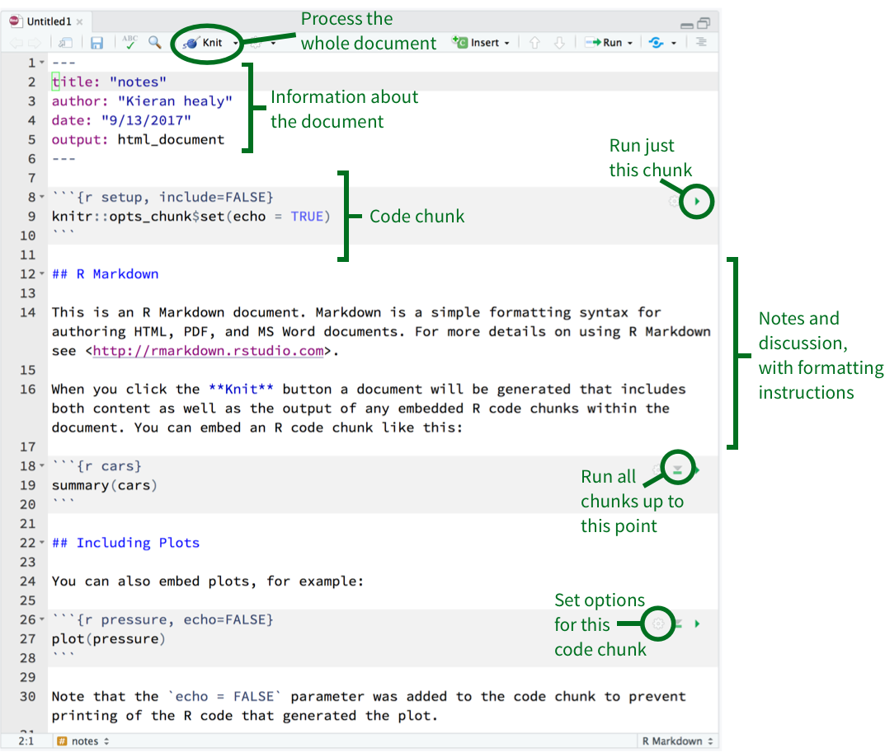
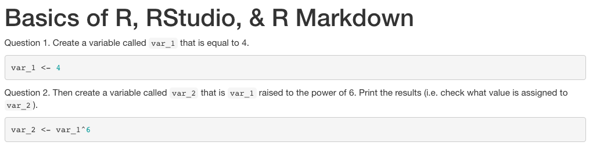
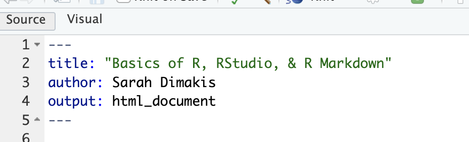
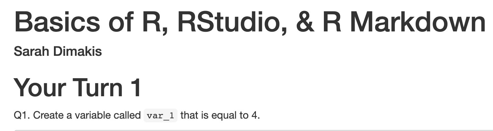

```{r setup, include=FALSE}
options(htmltools.dir.version = FALSE)
library(countdown)
library(tidyverse)

xaringanExtra::use_xaringan_extra(include = c("panelset", "tile_view", "share_again"))
xaringanExtra::style_share_again(share_buttons = c("twitter", "linkedin", "pocket"))

# your turn counter
yt_counter <- 0
```

```{r xaringan-themer, include=FALSE, warning=FALSE}
library(xaringanthemer)
style_mono_accent(base_color = "#15758c",
                text_font_google = google_font("Montserrat", "300", "300i"),
                code_font_google = google_font("Source Code Pro"),
                link_color = "#15758c",
                code_inline_color = "#fc653a")
```

class: title-slide, center, middle

# Basics of R, RStudio, & R Markdown

---
background-image: url(images/rstudio_blank2.png)
background-size: 900px

# RStudio IDE

---
background-image: url(images/rstudio_editor2.png)
background-size: 900px

# RStudio IDE

---
background-image: url(images/rstudio_console2.png)
background-size: 900px

# RStudio IDE

---
background-image: url(images/rstudio_environment2.png)
background-size: 900px

# RStudio IDE

---
background-image: url(images/rstudio_plots2.png)
background-size: 900px

# RStudio IDE
---
background-image: url(images/rstudio_labelled2.png)
background-size: 900px

# RStudio IDE

---
# Basic computing

--

```{r}
# addition
2 + 3
```

--

```{r}
# subtraction
2 - 3
```

--

```{r}
# multiplication
2 * 3
```

--

```{r}
# division
10 / 2
```

---
# Basic computing

```{r}
# exponents
4^2
```

--

```{r}
# modulo
20 %% 10
```

--

```{r}
# roots
4^(1/2)
```

--

```{r}
# logs
log10(100)
```

---
# Basic computing

Thankfully, R follows the order of operations.

```{r}
2 + 2 * 3
```

--

```{r}
(2 + 2) * 3
```

--

***

All of the values computed thus far haven't been stored anywhere though...

---

# Storing values in objects

To keep a value in memory, we need to assign it to an **object**. 

--

To assign a value to an object, use the **assignment operator**. It looks like a left-pointing arrow: 

.center[
### `<-`
]

--
***

Let's use `<-` to assign the number 8 to an object called `x`.

```{r}
x <- 8 
```

--

Now we can call `x` by name, and it will print the value.

```{r}
x
```

---
# Style

Technically, both `<-` and `=` work as assignment operators. But we'll strictly use `<-` from here on out. 

--
***

This brings up a general coding principle of the day...

--


**Style is important!**

You want to use a consistent style so that others (including your future self) can easily and quickly read your code. 

--

We highly recommend following the [tidyverse style guide](https://style.tidyverse.org/). We'll talk more about the tidyverse tomorrow.

--
***

Hint: You will type `<-` a LOT. The keyboard shortcut `Alt` + `-` or `Option` + `-` can be used to insert a `<-`.

---
# Storing values in objects

Now, let's take a look at the variable `y`...

--

```{r error=TRUE}
# print y
y 
```

--
***

Whoops! We didn't assign anything to `y`. Calling a variable that doesn't exist leads to an **error message**. 

--

You'll see a LOT of error messages when using R. Don't worry when this happens. This is 100% normal, and it happens to everyone all the time. 

--
***

```{r}
# assign 2 to y
y <- 2

# print y
y
```

---
# Storing values in objects

Now, we can use these variables in calculations.

--

***

Remember, `x <- 8` and `y <- 2`?

We can multiply them:

```{r}
x * y
```

--
***

But, remember, if we want to save the output of that calculation, we need to assign it to an object! 

```{r}
# assign the the product of x and y to z
z <- x * y

# print z
z
```

---
# Naming variables 

You may be wondering how to name variables in R. There are just a few rules...

--

1. Object names should start with a letter.

2. Object names can contain alphanumeric characters, underscores (`_`), and/or periods (`.`).

3. R is case sensitive, so `A` and `a` are different variables.

--
***

This is another element of *style*. 

Using a consistent style when naming variables makes your life easier. There are several to choose from.

---
# Naming variables 

.footnote[Artwork by [@allison_horst](https://twitter.com/allison_horst)]

.pull-left[

### Some examples

+ this_is_snake_case
+ thisIsCamelCase
+ avoid.using.periods

I'll be using snake_case from here on out, but you can change to another option if you'd like.
]

.pull-right[
```{r echo=FALSE}
knitr::include_graphics("images/coding_cases.png")
```
]
  
---
class: yourturn
# Your turn `r (yt_counter <- yt_counter + 1)`

```{r echo=FALSE}
countdown(minutes = 2, seconds = 00)
```

Open the `01_r_basics.Rmd` file.

1. Create a variable called `var_1` that is equal to 4.

1. Then create a variable called `var_2` that is `var_1` raised to the power of 6. 

1. Print the results (i.e. check what value is assigned to `var_2`).


---
class: solution
# Solution

.panelset[
.panel[.panel-name[Q1]
```{r}
var_1 <- 4
```
]

.panel[.panel-name[Q2]
```{r}
var_2 <- var_1^6
var_2
```
]
]

---
# R Markdown

.footnote[Artwork by [@allison_horst](https://twitter.com/allison_horst)]

R Markdown is a magical thing. It allows you to combine R code and plain text together in the same document. 

R Markdown documents end with the extension `.Rmd`. Let's take a look at how they work...

.center[
```{r echo=FALSE, out.width="70%"}
knitr::include_graphics("images/rmarkdown_wizards.png")
```
]

---
# R Markdown

```{r echo=FALSE, out.width="70%"}

```

.footnote[Image from [Kieran Healy](https://socviz.co/gettingstarted.html)]

---
class: yourturn
# Your turn `r (yt_counter <- yt_counter + 1)`

```{r echo=FALSE}
countdown(minutes = 2)
```

1. Go back to `01_r_basics.Rmd` and click `knit`. Take a look at the resulting file called `01_r_basics.html`. 

2. Insert `author: [YOUR NAME]` after `title: "Basics of R, RStudio, & R Markdown"` but before `output: html_document`. Re-knit the document. 

---
class: solution

# Solution

.panelset[
.panel[.panel-name[Q1]
```{r echo=FALSE, out.width="80%"}

```
]

.panel[.panel-name[Q2]

```{r echo=FALSE, out.width="80%"}

```

```{r echo=FALSE, out.width="80%"}

```
]
]

---
class: inverse, center, middle
# Q & A

```{r echo=FALSE}
countdown(minutes = 5)
```

---
class: inverse, center, middle
# Break! 

```{r echo=FALSE}
countdown(minutes = 5)
```


