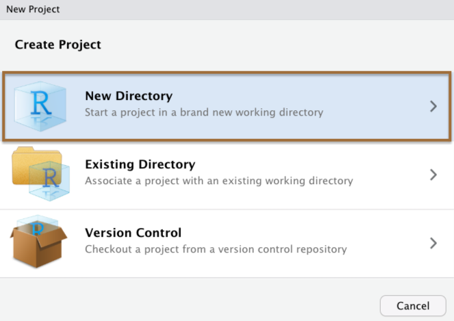
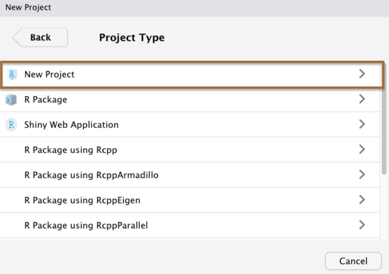
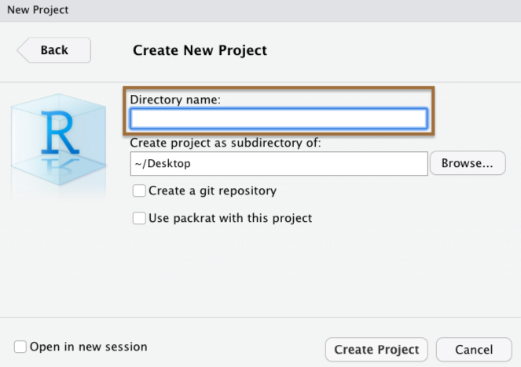
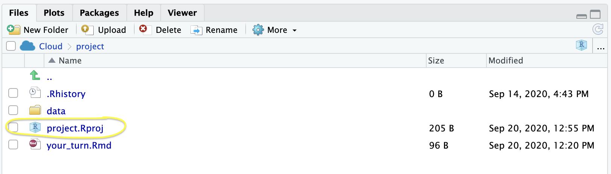

```{r setup, include=FALSE}
options(htmltools.dir.version = FALSE)
library(countdown)
library(tidyverse)

xaringanExtra::use_xaringan_extra(include = c("panelset", "tile_view", "share_again"))
xaringanExtra::style_share_again(share_buttons = c("twitter", "linkedin", "pocket"))

# your turn counter
yt_counter <- 0
```

```{r xaringan-themer, include=FALSE, warning=FALSE}
library(xaringanthemer)
style_mono_accent(base_color = "#15758c",
                text_font_google = google_font("Montserrat", "300", "300i"),
                code_font_google = google_font("Source Code Pro"),
                link_color = "#15758c",
                code_inline_color = "#fc653a")
```

class: title-slide, center, middle

# Importing Data & Project-Oriented Workflows

---

# Importing data

Importing data in R has 2 challenging aspects...

--

1. You need to call a function that works with a particular data format (e.g., `.csv`, `.txt`, `.sav`)

--

2. You need to tell R where to look for the data

---
# Importing data

### Challenge 1: File types

--

.pull-left[

.center[
### {readr}

```{r echo=FALSE, out.width="55%"}

```

`read_csv()`, `read_tsv()`, `read_delim()`, `read_fwf()`, etc...
]
]

--

.pull-right[

.center[
### {rio}

```{r echo=FALSE, out.width="55%"}
knitr::include_graphics("images/hex/rio.png")
```

`import()`
]
]

---

# Importing data

### Challenge 1: File types


.pull-left[

.center[
### {readr}

```{r echo=FALSE, out.width="55%"}

```

`read_csv()`, `read_tsv()`, `read_delim()`, `read_fwf()`, etc...
]
]


.pull-right[

.center[
### {rio}

```{r echo=FALSE, out.width="55%"}
knitr::include_graphics("images/hex/rio.png")
```

`import()`

`r emo::ji("check")`
]
]

---
# Importing data

### `rio::import()`

With `{rio}`, we just call `import()` and under the hood it calls the right read function given the file's extension (`.csv`, `.txt`, `.sav`, `.xlsx`).

--

We'll get some practice with this in a few minutes.

---
# Project-oriented workflows

### Challenge 2: File paths

--

When R looks for a file, it has a starting point. This is called the **working directory**. 

--

The working directory that you're currently in is displayed in the console window and the files tab. Let's take a look in RStudio. 

--
***

If you ever get lost, you can print your working directory with `getwd()`

--

If you are working in a `.Rmd` document, R by default will set whatever folder on your computer where that `.Rmd` file lives as your working directory 

--

```{r}
getwd()
```

For example, I created these slides in a `.Rmd` document that lives in this folder on my computer `r emo::ji("point_up")`

---
class: split-three
# Project-oriented workflows

### RStudio Projects

The best way to simplify issues with working directories is to use **RStudio Projects**. 

--
***

.column[.content[.center[
<br><br><br><br><br><br><br><br><br><br><br><br><br>

### Step 1
```{r echo = FALSE, out.width="90%"}

```
]]]

.column[.content[.center[
<br><br><br><br><br><br><br><br><br><br><br><br><br>

### Step 2
```{r echo = FALSE, out.width="90%"}

```


]]]

.column[.content[.center[
<br><br><br><br><br><br><br><br><br><br><br><br><br>

### Step 3
```{r echo = FALSE, out.width="90%"}

```

]]]

---
# Project-oriented workflows

### RStudio Projects

When you create a Project in RStudio, it is associated with a folder somewhere on your computer. 

--

It will automatically create a `.Rproj` file in that folder, which will keep track of the "top level" of your project. 

--
***

```{r echo=FALSE}

```

---
class: yourturn
# Your turn `r (yt_counter <- yt_counter + 1)`

```{r echo=FALSE}
countdown(minutes = 6)
```


Q1. Load the `{rio}` package.

Q2. Run the following code to import the data called `pragmatic_scales_data.csv`. Why do you get an error? Where is this file saved? *Hint*: Look through the folder(s) in the Files pane

```{r eval=FALSE}
ps_data <- import("pragmatic_scales_data.csv")
```

Q3. Fix the error in the code above to import the data.

Q4. Remember that `{rio}` is flexible with file types---`rio::import()` will call the right function under the hood to read in the file based on the file extension. Use `{rio}` to import `pragmatic_scales_data.sav` (an SPSS file type) and save it to a new object named `ps_data_2`.

---
class: solution
# Solution

.panelset[
.panel[.panel-name[Q1]

```{r message=FALSE, warning=FALSE}
library(rio)
```
]

.panel[.panel-name[Q2]

```{r error=TRUE}
ps_data <- import("06_pragmatic_scales_data.csv")
```

***

The file **pragmatic_scales_data.csv** is saved in the **data** folder, so we need to tell R to look in that folder.
]

.panel[.panel-name[Q3]

```{r eval=FALSE}
ps_data <- import("data/06_pragmatic_scales_data.csv")
```

]

.panel[.panel-name[Q4]
```{r eval=FALSE}
ps_data_2 <- import("data/06_pragmatic_scales_data.sav")
```

]
]

---
# Exporting data

You can also use `{rio}` to export your data using `export()`.

--
***

Here are the arguments you will need to use for `export()`:

```{r eval=FALSE}
export(x, file)
```

--

`x` is the `data.frame` object in your RStudio Environment you want to export 

--

`file` is the path/filename for the resulting file 

--
***

For example, let's say I want to export `ps_data` as an `.xlsx` file and put it into the `data/` subdirectory.

```{r eval=FALSE}
export(ps_data, "data/ps_data.xlsx")
```

---
class: yourturn
# Your turn `r (yt_counter <- yt_counter + 1)`

```{r echo=FALSE}
countdown(minutes = 5)
```

1. Look through the Files pane and find the file `another_data_set.csv`. Make note of what subdirectory it is saved in. Import the data and save to an object called `another_df`.

1. Now export the data you just imported and save it into the `data/` directory. Make sure the name of the resulting file is `another_data_set`, and export it as a `.xlsx` file.

1. One of your colleagues insists you send them a `.sav` file so that they can run the analyses in SPSS. Make another copy of `another_data_set` in the `data/` subdirectory that is in the `.sav` format. 

---
class: solution
# Solution

.panelset[
.panel[.panel-name[Q1]

```{r eval=FALSE}
another_df <- import("data/more_data/another_data_set.csv")
```

]

.panel[.panel-name[Q2]

```{r eval=FALSE}
export(another_df, "data/another_data_set.xlsx")
```
]

.panel[.panel-name[Q3]


```{r eval=FALSE}
export(another_df, "data/another_data_set.sav")
```

]

]

---
# Viewing data

Now that your data is loaded in R, you'll want to take a look at it. There are a few different ways to do that, each offering different information.

--
***

### `View()`

```{r echo=FALSE, message=FALSE}
ps_data <- rio::import(here::here("static/slides/data/pragmatic_scales_data.csv"))
```


One way is to click on the `View` button in the environment pane.

--

You should see `ps_data` in the environment pane with a little data table icon at the far right. Click on that icon. 

--

You'll notice that this ran `View(ps_data)` in the console. We could have instead just typed this directly ourselves`*`---notice the capital `V` in `View()` `r emo::ji("eyes")`

--

***

`*` Feel free to use `View()` in the console, but please **never** write `View()` in your scripts. It can be disorienting for people who are running through your code to suddenly have the focal window change. 

---
# Viewing data 

### `head()` and `tail()`

--

.panelset[
.panel[.panel-name[`head()`]

You can also see just the first six rows of a data frame with `head()`, which is especially helpful for large data sets.

```{r}
head(ps_data)
```
]

.panel[.panel-name[`tail()`]

`tail()` is the complement to `head()`, displaying just the final six rows from a data frame.

```{r}
tail(ps_data)
```
]
]

---
# Viewing data

### `str()` and `glimpse()`

.panelset[
.panel[.panel-name[`str()`]

We saw `str()` when we first introduced data frames. It's worth mentioning it again because it can be so useful when you import data to see how your variables were read in (i.e. their types)

```{r}
str(ps_data)
```

]

.panel[.panel-name[`glimpse()`]

`glimpse()` is very similar to `str()` but is a tidyverse function, and it shows you a little more raw data 

```{r}
glimpse(ps_data)
```

]
]

---
# Viewing data

### `tibble()`

As noted in the previous slide deck, a `tibble` is much like the data frame in base R, but **it has nicer printing methods**. 

--

As a result, you only have to call a `tibble` to see much of the information you would be interested in.

---
# Viewing data

### `tibble()`

```{r}
ps_data <- tibble(ps_data)

ps_data
```

---
class: yourturn

# Your turn `r (yt_counter <- yt_counter + 1)`

```{r echo=FALSE}
countdown(minutes = 4)
```

1. Take a look at `another_df`, which should be in your Global Environment. Click the "View" button in the Environment pane and also use `View()` in your Console. 

1. Now look at some summary information about `another_df` using `str()` and `glimpse()`. *Hint*. You will need to load the tidyverse package first in order to use `glimpse()`.

1. Lastly, find the number of rows and columns in `another_df` using `nrow()` and `ncol()`, respectively. Make sure your answers match the summary information given to you above. 

---
class: solution

# Solution

```{r echo=FALSE, message=FALSE}
another_df <- rio::import(here::here("static/slides/data/another_data_set.csv"))
```


.panelset[
.panel[.panel-name[Q1]

```{r eval=FALSE}
View(another_df)
```
]

.panel[.panel-name[Q2]

```{r message=FALSE, warning=FALSE}
library(tidyverse)

str(another_df)

glimpse(another_df)
```
]

.panel[.panel-name[Q3]

```{r}
nrow(another_df)
ncol(another_df)
```

]
]
 
---
class: inverse, center, middle
# Q & A

```{r echo=FALSE}
countdown(minutes = 5)
```

---
class: inverse, center, middle
# Break! 

```{r echo=FALSE}
countdown(minutes = 30)
```

