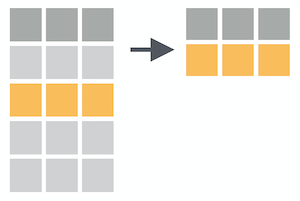
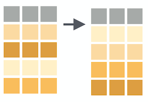
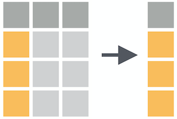
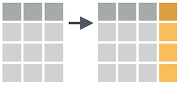
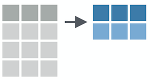
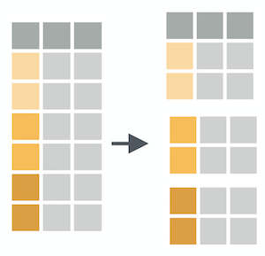
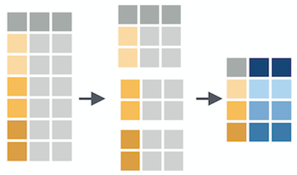

```{r setup, include=FALSE}
options(htmltools.dir.version = FALSE)
library(countdown)
library(tidyverse)

xaringanExtra::use_xaringan_extra(include = c("panelset", "tile_view", "share_again"))
xaringanExtra::style_share_again(share_buttons = c("twitter", "linkedin", "pocket"))

# your turn counter
yt_counter <- 0
```

```{r xaringan-themer, include=FALSE, warning=FALSE}
library(xaringanthemer)
style_mono_accent(base_color = "#15758c",
                text_font_google = google_font("Montserrat", "300", "300i"),
                code_font_google = google_font("Source Code Pro"),
                link_color = "#15758c",
                code_inline_color = "#fc653a",
                colors = c(
                  blue = "#6495ed",
                  red = "#f34213",
                  purple = "#3e2f5b",
                  orange = "#ff8811",
                  green = "#136f63",
                  white = "#FFFFFF"))
```

class: title-slide, center, middle

# Data Wrangling with {dplyr}

---
background-image: url(images/hex/tidyverse.png)
background-position: 90% 5%
background-size: 10%

# Tidyverse 

There are a few key ideas to be aware of about how the tidyverse works in general before we dive into `{dplyr}`

--

1. Packages are designed to be like **grammars** for their task. You can string these grammatical elements together to form more complex statements, just like with language.

--

1. The first argument of (basically) every function is `data`. This is very handy, especially when it comes to piping.

--

1. Variable names are usually not quoted (read more [here](https://tidyselect.r-lib.org/reference/language.html)).

---
background-image: url(images/hex/dplyr.png)
background-position: 90% 5%
background-size: 10%

# Star Wars

```{r, echo = FALSE}
starwars <- starwars %>%
  select(name, height, mass, hair_color, eye_color, species)
```

```{r warning=FALSE, message=FALSE}
starwars
```

---
background-image: url(images/hex/dplyr.png)
background-position: 90% 5%
background-size: 10%

# {dplyr}

`{dplyr}` is a grammar of data manipulation, providing a consistent set of core verbs that help you solve the most common data manipulation challenges

--
***

**Manipulating observations**

+ `filter()` picks cases based on their values.

+ `arrange()` changes the ordering of the rows.

--
***

**Manipulating variables**

+ `select()` picks variables based on their names.

+ `mutate()` adds new variables that are functions of existing variables.

--
***

**Summarizing data**

+ `summarise()` reduces multiple values down to single summary statistics.


---
background-image: url(images/hex/magrittr.png)
background-position: 90% 5%
background-size: 10%

# A review of pipes

`x %>% f(y)` is equivalent to `f(x, y)`

--
***

R Code 

```{r eval=FALSE}
starwars %>% 
  filter(species == "Droid") %>% 
  select(name, height, mass) %>% 
  arrange(desc(height))
```

--

Translated into English

```{r eval = FALSE}
start with star wars data *AND THEN*
  filter to include only observations from Droids *AND THEN*
  select only the columns `name`, `height`, and `mass` *AND THEN*
  arrange observations by descending order of `height`
```

--
***
Read more on piping: [https://magrittr.tidyverse.org/reference/pipe.html](https://magrittr.tidyverse.org/reference/pipe.html)

---
class: inverse, center, middle

# Manipulating observations <br> (rows)

---
background-image: url(images/hex/dplyr.png)
background-position: 90% 5%
background-size: 10%

# `filter()`

### Subset observations (rows) with `filter()`

```{r echo=FALSE}

```

---
background-image: url(images/hex/dplyr.png)
background-position: 90% 5%
background-size: 10%

# `filter()`

```{r echo=FALSE}
knitr::include_graphics("images/dplyr_filter.jpg")
```

.footnote[Artwork by [@allison_horst](https://twitter.com/allison_horst)]

---
background-image: url(images/hex/dplyr.png)
background-position: 90% 5%
background-size: 10%

# `filter()`

```{r include = FALSE}
comp_table <- tibble::tribble(
  ~Operator, ~Description, ~Usage,
  "<", "less than", "x < y",
  "<=", "less than or equal to", "x <= y",
  ">", "greater than", "x > y",
  ">=", "greater than or equal to", "x >= y",
  "==", "exactly equal to", "x == y",
  "!=", "not equal to", "x != y",
  "&", "and", "x == a & y == b",
  "|", "or", "x == a | y == b",
  "%in%", "group membership", "x %in% y",
  "is.na", "is missing", "is.na(x)",
  "!is.na", "is not missing", "!is.na(x)"
)
```

```{r echo = FALSE, results = 'asis'}
knitr::kable(comp_table, format = "html")
```

.footnote[Source: [Alison Hill](https://share-blogdown.netlify.app/slides/02-slides.html#15)]

---
background-image: url(images/hex/dplyr.png)
background-position: 90% 5%
background-size: 10%

# `filter()`

.panelset[

.panel[.panel-name[Arguments]

```{r eval = FALSE}
filter(.data, ...)
```

`.data` is a data frame or tibble

`...` includes expressions that return a logical value and are defined in terms of the variables in .data. If multiple expressions are included, they are combined with the & operator. Only rows for which all conditions evaluate to TRUE are kept.
]

.panel[.panel-name[Example 1]

```{r}
starwars %>% 
  filter(species == "Human" & eye_color != "blue")
```

]

.panel[.panel-name[Example 2]

```{r}
starwars %>% 
  filter(species %in% c("Wookiee", "Ewok"))
```
]

.panel[.panel-name[Example 3]

```{r}
starwars %>% 
  filter(!is.na(hair_color))
```
]

.panel[.panel-name[Example 4]

```{r}
starwars %>% 
  filter(height <= 100)
```
]

]

---
background-image: url(images/hex/dplyr.png)
background-position: 90% 5%
background-size: 10%

# `arrange()`

### Arrange rows by column values with `arrange()`

```{r echo=FALSE}

```

---
background-image: url(images/hex/dplyr.png)
background-position: 90% 5%
background-size: 10%

# `arrange()`

.panelset[

.panel[.panel-name[Arguments]

```{r eval = FALSE}
arrange(.data, ...)
```

`.data` is a data frame or tibble

`...` are the variables to sort by. Use `desc()` to sort a variable in descending order
]

.panel[.panel-name[Example 1]

```{r}
starwars %>% 
  arrange(mass)
```

]

.panel[.panel-name[Example 2]

```{r}
starwars %>% 
  arrange(desc(mass))
```
]
]

---
class: yourturn

# Your turn `r (yt_counter <- yt_counter + 1)`

```{r echo=FALSE}
countdown(minutes = 4)
```

1. Convert the data frame `mtcars` to a tibble and assign the resulting object to `data`. *Note.* The data frame `mtcars` is automatically loaded in R; you don't have to install it separately.

1. Filter `data` for cars that have 4 `cyl`. Arrange the resulting observations by descending order of `mpg`.

1. Filter `data` for cars that have `disp`s greater than or equal to 350, `hp`s greater than or equal to 200, and `qsec`s less than or equal to 17. 

1. Filter `data` for cars that have `carb`s equal to 4 or `cyl`s equal to 4. Assign the result to an object called `data_filtered`.
---
class: solution

# Solution

.panelset[
.panel[.panel-name[Q1]

```{r eval=TRUE}
data <- tibble(mtcars)
```

]

.panel[.panel-name[Q2]

```{r}
data %>% 
  filter(cyl == 4) %>% 
  arrange(desc(mpg))
```

]

.panel[.panel-name[Q3]

```{r}
data %>% 
  filter(disp >= 350, hp >= 200, qsec <= 17)
```

```{r}
data %>% 
  filter(disp >= 350 & hp >= 200 & qsec <= 17)
```

]

.panel[.panel-name[Q4]

```{r}
data_filtered <- data %>% 
  filter(carb == 4 | cyl == 4)

data_filtered
```

]
]

---
class: inverse, center, middle

# Manipulating variables <br> (columns)

---
background-image: url(images/hex/dplyr.png)
background-position: 90% 5%
background-size: 10%

# `select()`

### Select columns with `select()`

```{r echo=FALSE}

```


---
background-image: url(images/hex/dplyr.png)
background-position: 90% 5%
background-size: 10%

# `select()`

.panelset[

.panel[.panel-name[Arguments]

```{r eval = FALSE}
select(.data, ...)
```

`.data` is a data frame or tibble

`...` is one or more unquoted expressions separated by commas. Variable names can be used as if they were positions in the data frame, so expressions like `x:y` can be used to select a range of variables.
]


.panel[.panel-name[Example 1]

```{r}
starwars %>%
  select(name, mass)
```

]

.panel[.panel-name[Example 2]

```{r}
starwars %>%
  select(height:hair_color)
```

]

]

---
background-image: url(images/hex/dplyr.png)
background-position: 90% 5%
background-size: 10%

# Selection helpers

Selection helpers work in concert with `select()` to make it easier to select specific groups of variables.

--

***

Here are some commonly used ones:

`everything()`: Matches all variables.

`last_col()`: Select last variable.

`starts_with()`: Starts with a prefix.

`ends_with()`: Ends with a suffix.

`contains()`: Contains a literal string.

`matches()`: Matches a regular expression.

.footnote[`r emo::ji("link")` https://dplyr.tidyverse.org/reference/dplyr_tidy_select.html#overview-of-selection-features]

---
background-image: url(images/hex/dplyr.png)
background-position: 90% 5%
background-size: 10%

# Selection helpers

Selection helpers work in concert with `select()` to make it easier to select specific groups of variables.


.panelset[

.panel[.panel-name[Example 1]

```{r}
starwars %>%
  select(starts_with("h"))
```
]

.panel[.panel-name[Example 2]

```{r}
starwars %>%
  select(ends_with("color"))
```
]

.panel[.panel-name[Example 3]

```{r}
starwars %>%
  select(contains("_"))
```
]

]

---
background-image: url(images/hex/dplyr.png)
background-position: 90% 5%
background-size: 10%

# `mutate()`

### Create (or overwrite) variables with `mutate()`

```{r echo=FALSE}

```

---
background-image: url(images/hex/dplyr.png)
background-position: 90% 5%
background-size: 10%

# `mutate()`

.center[
```{r echo=FALSE, out.width="75%"}
knitr::include_graphics("images/dplyr_mutate.png")
```
]

.footnote[Artwork by [@allison_horst](https://twitter.com/allison_horst)]

---
background-image: url(images/hex/dplyr.png)
background-position: 90% 5%
background-size: 10%

# `mutate()`

.panelset[

.panel[.panel-name[Arguments]

```{r eval = FALSE}
mutate(.data, ...)
```

`.data` is a data frame or tibble

`...` are name-value pairs. The name gives the name of the column in the output.

]

.panel[.panel-name[Example 1]

```{r}
starwars %>%
  mutate(height_in = height * .39)
```

]

.panel[.panel-name[Example 2]

```{r}
starwars %>%
  mutate(height_lb = mass * 2.2)
```
]

.panel[.panel-name[Example 2]

```{r}
starwars %>%
  mutate(species = tolower(species))
```
]

]

---
class: yourturn

# Your turn `r (yt_counter <- yt_counter + 1)`

```{r echo=FALSE}
countdown(minutes = 5)
```

1. In `data`, select only the variables `mpg` and `hp`. 

1. As we did with indexing in base R, you can use the minus sign (`-`) to "de-select" columns. Keep everything in `data` except `vs`.

1. Use `mutate()` to convert `cyl` from type "dbl" to type "factor".

---
class: solution

# Solution

.panelset[
.panel[.panel-name[Q1]

```{r}
data %>%
  select(mpg, hp)
```

]

.panel[.panel-name[Q2]

```{r}
data %>%
  select(-vs)
```

]

.panel[.panel-name[Q3]

```{r}
data %>% 
  mutate(cyl = as.factor(cyl))
```

]
]

---
class: inverse, center, middle

# Summarizing data

---
background-image: url(images/hex/dplyr.png)
background-position: 90% 5%
background-size: 10%

# `summarize()`

`summarize()` reduces your raw data frame into a smaller summary data frame that only contains the variables resulting from the **summary functions** that you specify within `summarize()`

```{r echo=FALSE, out.width="40%"}

```

--
***

Summary functions take vectors as inputs and return single values as outputs.

```{r echo=FALSE}

```

Common examples are `mean()`, `sd()`, `max()`, `min()`, `sum()`, etc...

---
background-image: url(images/hex/dplyr.png)
background-position: 90% 5%
background-size: 10%

# `summarize()`

.panelset[

.panel[.panel-name[Arguments]

```{r eval = FALSE}
summarize(.data, ...)
```

`.data` is a data frame or tibble]

`...` are name-value pairs of summary functions. The names will be the names of the variable in the resulting object.

.panel[.panel-name[Example]

```{r}
starwars %>% 
  summarize(mean_height = mean(height, na.rm = TRUE),
            max_mass    = max(mass, na.rm = TRUE))
```

]

]

---
background-image: url(images/hex/dplyr.png)
background-position: 90% 5%
background-size: 10%

# `group_by()`

`group_by()` creates groups based on one or more variables in the data, and this affects any downstream operations.

```{r echo=FALSE, out.width="50%"}

```

---
background-image: url(images/hex/dplyr.png)
background-position: 90% 5%
background-size: 10%

# `group_by()`

What happens if we combine `group_by()` and `summarize()`? 

```{r echo=FALSE, out.width="75%"}

```

---
background-image: url(images/hex/dplyr.png)
background-position: 90% 5%
background-size: 10%

# `summarize()`

Let's see a couple examples of how we can combine `group_by()` and `summarize()`

.panelset[

.panel[.panel-name[Example 1]

```{r}
starwars %>% 
  group_by(species) %>% 
  summarize(mean_mass = mean(mass, na.rm = TRUE),
            sd_mass   =   sd(mass, na.rm = TRUE))
```

]

.panel[.panel-name[Example 2]

```{r}
starwars %>% 
  group_by(species, eye_color) %>% 
  summarize(mean_mass = mean(mass, na.rm = TRUE),
            sd_mass   =   sd(mass, na.rm = TRUE))
```

]


]

---
class: yourturn

# Your turn `r (yt_counter <- yt_counter + 1)`

```{r echo=FALSE}
countdown(minutes = 5)
```

1. From `data`, get the mean `hp` for each of the different `cyl` values.

1. Now get the mean `hp` for each unique combination of `cyl` and `gear` and arrange the resulting rows by descending order of `hp`. Which combination of `cyl` and `gear` had the greatest `hp`?

---
class: solution

# Solution

.panelset[
.panel[.panel-name[Q1]

```{r}
data %>% 
  group_by(cyl) %>% 
  summarize(mean_hp = mean(hp))
```

]

.panel[.panel-name[Q2]

```{r}
data %>% 
  group_by(cyl, gear) %>% 
  summarize(mean_hp = mean(hp)) %>% 
  arrange(desc(mean_hp))
```

]

]

---
background-image: url(images/hex/dplyr.png)
background-position: 90% 5%
background-size: 10%

# Deeper dive

What if we want to apply dplyr verbs across multiple columns and rows **simultaneously**?

```{r echo=FALSE}
knitr::include_url("https://dplyr-wisely.netlify.app/")
```

.footnote[`r emo::ji("link")` [dplyr-wisely.netlify.app](https://dplyr-wisely.netlify.app/)]

---
class: inverse, center, middle
# Q & A

```{r echo=FALSE}
countdown(minutes = 5)
```